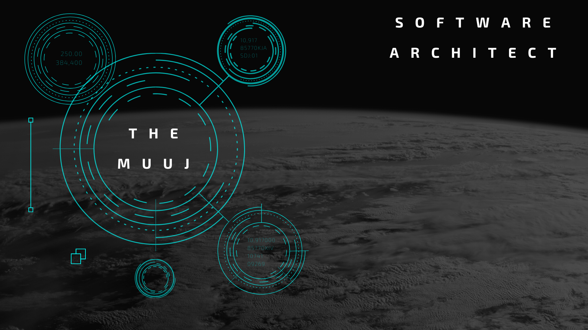

## Academic Interests

- :computer: Computer Science
- :floppy_disk: Software Engineering
- :rocket: Space Science
- :infinity: Mathematics
- :atom_symbol: Physics
- :books: History
- :earth_americas: Political Science

## Technologies and Tools

